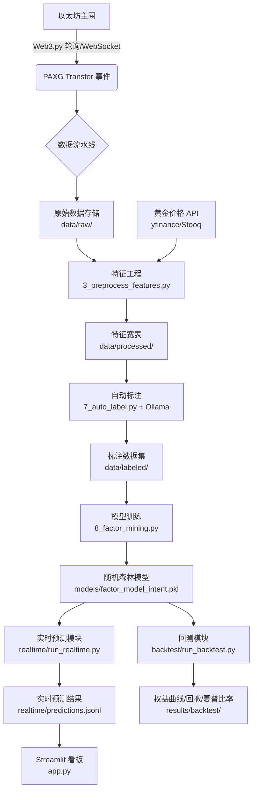

# PAXG Onchain Quant – 基于链上数据的黄金代币量化因子与 AI 策略

# 自动抓取 PAXG 转账事件，通过 LLM 初标+人工复核构建训练集，训练随机森林模型预测交易意图（accumulation/distribution/normal），并实现实时预测、回测验证、Streamlit 看板。

# 系统架构图：

# 主要功能：

	链上数据采集（Web3.py）

	特征工程（余额、金额、时间、黄金价格变化）

	自动标注（Ollama + Gemma3）

	模型训练（随机森林，输出特征重要性）

	实时预测（WebSocket 监听，实时决策）

	回测引擎（模拟交易，夏普比率等指标）

	可视化看板（Streamlit）

	快速开始：环境配置、安装依赖、数据获取、运行流水线等步骤。

	结果示例：贴出特征重要性图、回测权益曲线、实时预测截图。

	项目结构：简要说明目录树。

# 技术栈：Python, Web3, Pandas, Scikit-learn, Streamlit, Ollama, etc.

# 项目目录树：

PAXG-Onchain-Quant/
├── data/                     # 数据存储
│   ├── raw/                  # 原始链上事件、黄金价格CSV
│   ├── processed/            # 特征宽表（Parquet）、标注断点文件
│   ├── labeled/              # 划分后的训练/验证/测试集
│   ├── realtime/             # 实时预测记录（动态生成）
│   └── sample/             # 最小单元示例
├── scripts/                  # 数据处理流水线（按顺序执行）
│   ├── 1_fetch_paxg_transfers.py
│   ├── 2_fetch_gold_price.py
│   ├── 3_preprocess_features.py
│   ├── 6_build_dataset.py
│   ├── 7_auto_label.py
│   └── 8_factor_mining.py
├── realtime/                 # 实时预测模块
│   ├── config.py             # RPC、模型路径、阈值配置
│   ├── state_cache.py        # 地址余额、黄金价格缓存
│   ├── feature_extractor.py  # 实时特征计算
│   ├── predictor.py          # 加载模型、预测意图
│   ├── stream_handler.py     # 保存预测结果到文件
│   └── run_realtime.py       # 主入口：监听新区块并预测
├── backtest/                 # 回测模块（策略验证）
│   ├── config.py             # 回测参数（资金、费率、阈值）
│   ├── signals.py            # 基于预测生成买卖信号
│   ├── engine.py             # 模拟交易引擎
│   ├── metrics.py            # 夏普比率、最大回撤等指标
│   └── run_backtest.py       # 执行回测并输出结果
├── models/                   # 训练好的模型
│   └── factor_model_intent.pkl
├── results/backtest/         # 回测输出（图片、指标、交易明细）
├── app.py                    # Streamlit 可视化看板
├── requirements.txt          # Python 依赖
├── .env                      # 环境变量（ETH_RPC_URL等）
└── README.md

################### 完整数据生成指南 ###################

# 1. 创建并激活环境
conda create -n web3-gold python=3.10
conda activate web3-gold

# 安装依赖
pip install -r requirements.txt

# 创建 .env 文件，并填入以太坊节点 URL（例如 Infura/Alchemy）
echo ETH_RPC_URL=https://mainnet.infura.io/v3/项目ID > .env

# 2. 配置 Ollama 本地模型
ollama pull gemma3:4b

# 3. 数据采集与特征工程
python scripts/1_fetch_paxg_transfers.py      # 从以太坊抓取 PAXG 转账（约 2.6 万条）
python scripts/2_fetch_gold_price.py          # 下载黄金价格数据，如自动下载失败可手动下载
python scripts/3_preprocess_features.py       # 特征工程，生成宽表

# 4. AI 自动标注（可选，也可使用已有标注）
# 修改 scripts/7_auto_label.py 中的 SAMPLE_SIZE 为你想要的数量（如500，测试可设为SAMPLE_SIZE=10）
python scripts/7_auto_label.py                # 调用 Ollama 进行标注（耗时数小时）

# 5. 构建数据集与训练模型
python scripts/6_build_dataset.py             # 合并标注与特征
python scripts/8_factor_mining.py             # 训练随机森林，输出特征重要性

# 6. 回测验证（可选）
python backtest/run_backtest.py       

# 7. 实时监控（可选）
python realtime/run_realtime.py     

# 8. 启动看板（将自动使用完整数据）
streamlit run app.py

################### 快速开始指南 ###################

1. 克隆仓库并安装依赖
2. 运行 `streamlit run app.py` 即可看到预置看板

> 示例数据位于 `data/sample/sample_labeled.parquet`，无需运行完整数据生成流程。